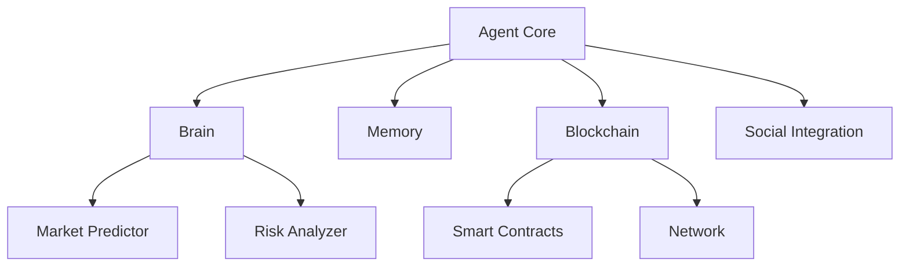

# AI Crypto Agent Architecture

## System Overview

The AI Crypto Agent is a sophisticated system that combines blockchain interaction, artificial intelligence, and automated trading capabilities. This document outlines the architectural design and key components.

## Core Components

### 1. Agent Core
```
src/agent/
├── core.py      # Main agent implementation
├── brain.py     # Decision-making logic
└── memory.py    # State management
```

The agent core handles:
- Decision-making processes
- State management
- Action execution
- Risk management

### 2. Blockchain Integration
```
src/blockchain/
├── contracts/
│   ├── erc20.py
│   ├── nft.py
│   └── liquidity_pool.py
├── network.py
└── wallet.py
```

Provides:
- Smart contract interaction
- Network communication
- Wallet management
- Transaction handling

### 3. AI Module
```
src/ai/
├── models/
│   ├── market_predictor.py
│   └── risk_analyzer.py
├── training/
└── inference.py
```

Implements:
- Market prediction models
- Risk assessment
- Sentiment analysis
- Performance optimization

## System Architecture



## Data Flow

1. **Market Data Input**
   - Price feeds
   - Volume data
   - Social sentiment
   - On-chain metrics

2. **Processing Pipeline**
   - Data normalization
   - Feature extraction
   - Model inference
   - Risk assessment

3. **Decision Making**
   - Strategy evaluation
   - Risk calculation
   - Action selection
   - Execution planning

4. **Execution**
   - Transaction building
   - Security checks
   - Network interaction
   - State updates

## Key Design Patterns

### 1. Observer Pattern
- Market event monitoring
- State change notifications
- Performance tracking

### 2. Strategy Pattern
- Trading strategies
- Risk management
- Portfolio allocation

### 3. Factory Pattern
- Contract deployment
- Transaction creation
- Model initialization

## Security Architecture

### 1. Transaction Security
- Multi-level validation
- Gas optimization
- Slippage protection
- Error recovery

### 2. Key Management
- Secure key storage
- Access control
- Encryption standards

### 3. Monitoring
- Performance metrics
- Error tracking
- Alert systems

## Scalability Considerations

### 1. Horizontal Scaling
- Multiple agent instances
- Load balancing
- State synchronization

### 2. Performance Optimization
- Caching strategies
- Batch processing
- Async operations

### 3. Resource Management
- Memory optimization
- Connection pooling
- Rate limiting

## Development Guidelines

### 1. Code Organization
- Modular structure
- Clear dependencies
- Interface definitions

### 2. Testing Strategy
- Unit tests
- Integration tests
- Performance testing

### 3. Documentation
- Code documentation
- API documentation
- Architecture updates

## Deployment Architecture

### 1. Development Environment
- Local testing
- Mock services
- Debug logging

### 2. Staging Environment
- Network integration
- Performance testing
- Security validation

### 3. Production Environment
- High availability
- Monitoring
- Backup systems